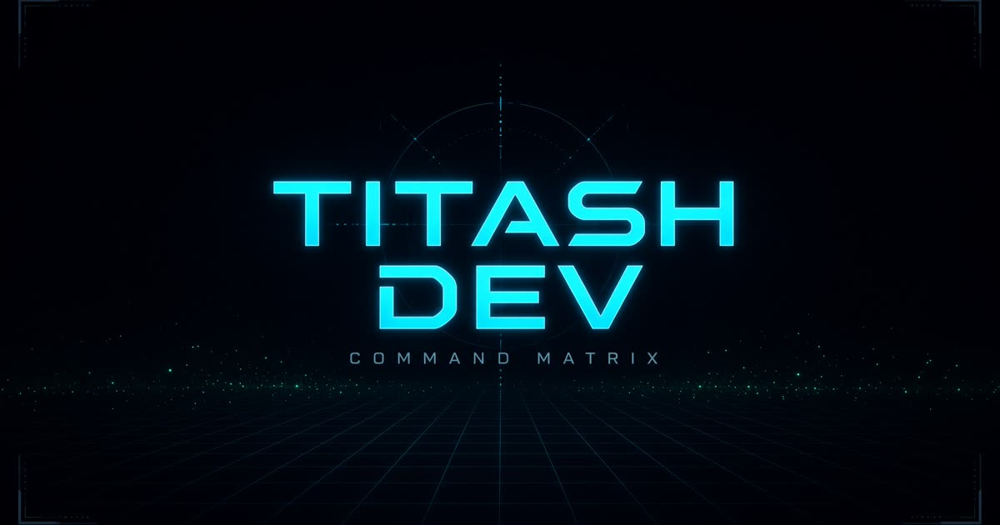

# command-matrix

Frontend portfolio of systems architecture case studies by [Titash Dev](https://github.com/titashdev-ops).

Live site: [dronly.in](https://dronly.in)



## What this is

A browsable set of architecture case studies, decision records, and interactive models. The visual system is a spatial HUD. The data is static files in `src/data/`.

## What this is not

- Not a live operations platform
- Not a UAV fleet controller, SAP system, or ServiceNow integration
- Not a production telemetry pipeline
- No auth, database, or CMS
- Moving numbers in the UI are a **client-side demo loop**, not production data

Status: **prototype / simulation**.

## Stack

- React 19
- Vite / TanStack Start
- Tailwind CSS v4
- Framer Motion
- Three.js / React Three Fiber

## Run locally

```bash
npm install
npm run dev
```

## Build

```bash
npm run build
npm run typecheck
```

Deployed as a Vercel project from this repository.

## Contact

The discovery wizard opens a `mailto:` brief to `titashdev@gmail.com`. There is no form backend.

## Layout

```text
src/           HUD UI, routes, and case-study data
public/        Favicon and share card
scripts/       Host-preview adapters (PWA/OG injection)
server/        TanStack Start / Nitro build adapter
```

The product is a static SPA. `scripts/` and `server/` exist so the same repo can build on the hosted preview and on Vercel. They are not an application backend. There is no runtime API.

## License

MIT. See [LICENSE](LICENSE).
